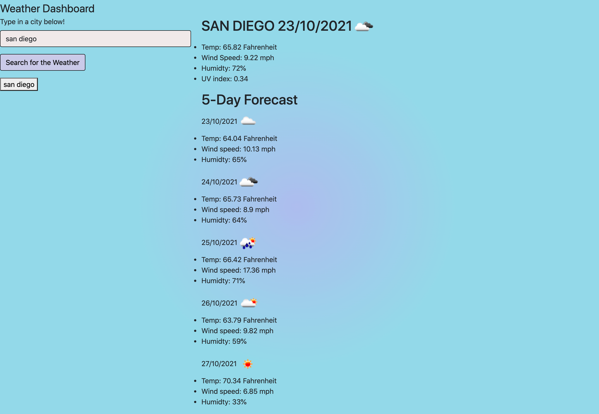

# Weather Dashboard

Week 6 homework where we had to create a weather dashboard using what we've been learning with API's, local storage, bootstrap, and more.

# Usage

<a href="https://hayleymchugh.github.io/weatherdashboard/">Deployed Dashboard</a>

<a href="https://github.com/HayleyMcHugh/weatherdashboard.git">Github</a>
